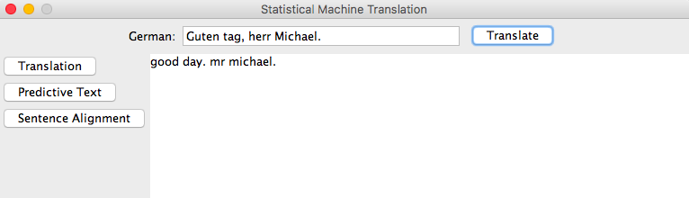
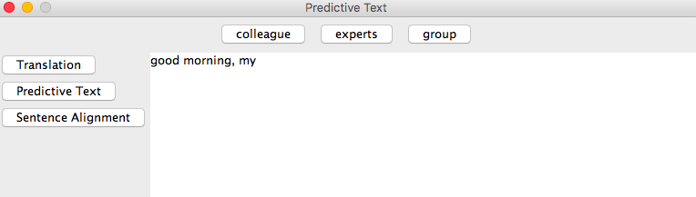
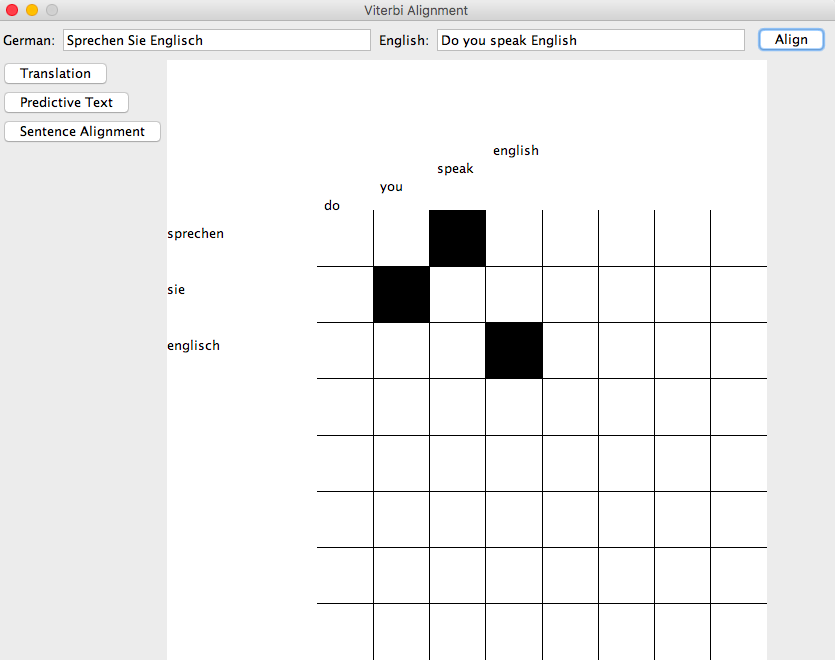

# Statistical Machine Translation

Bayesian machine translation project I created as a high school CS project in 2016. Refer to [smtinfosheet](smtinfosheet.pdf) for the info on how this project functions. Model was trained on a Europarl corpus containing side-by-side transcripts of UN proceedings in German and English. 

## Requirements: JAVA SE 6, DrJava (or similar Java IDE to run code)

## Setup

In order to run this project, download the pre-trained models from [this Google Drive folder](https://drive.google.com/drive/folders/10ZZ6L2dE-Cgl6onc1wOZHAgT2GLTvxDQ?usp=sharing) and place them in the same folder as the code files for this project; run Main.java to begin deserializing the models. This takes ~20 minutes.

This project supports simple translations, as such:

The project also uses the English probability counts to implement word prediction, as such:

Additionally, the project can take two sentences in English and German as input and attempt to match the words:

Ideas and pseudocode derived from https://www.isi.edu/natural-language/mt/wkbk.pdf.
